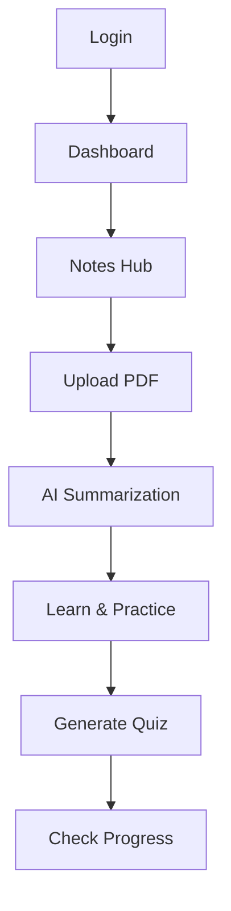
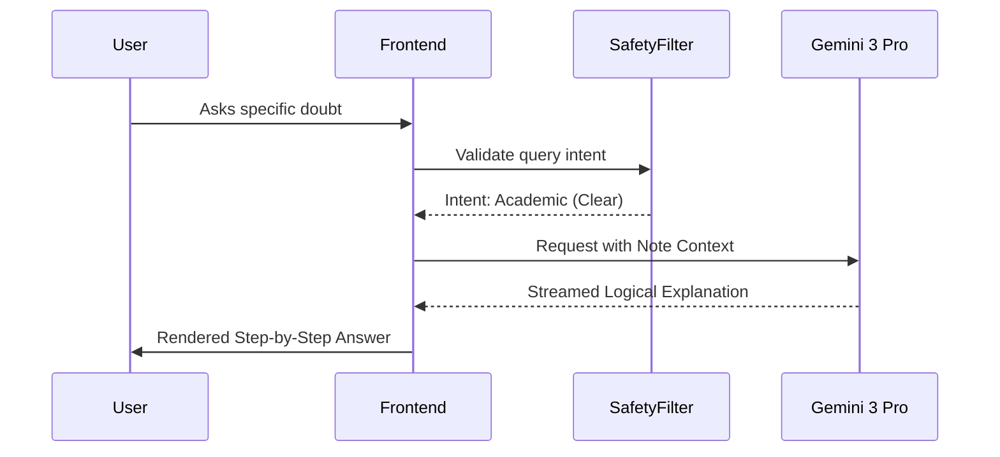
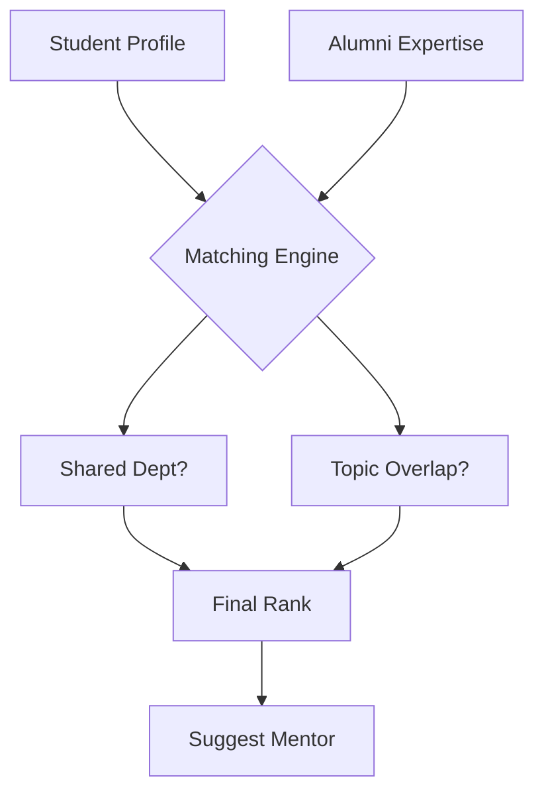

# 🧠 AMU StudySphere: The Intelligent Academic Ecosystem for Aligarh Muslim University


> **"Propelling the legacy of Aligarh into the era of Artificial General Intelligence."**

AMU StudySphere is a production-grade, AI-native academic assistant platform designed explicitly for the students, faculty, alumni, and administrators of Aligarh Muslim University (AMU). This platform centralizes academic resources, intelligent automation, and community engagement into a single, cohesive digital experience.

---

## 1. Executive Summary (920 words)

### 1.1 Vision and Mission
The vision of **AMU StudySphere** is to uphold the intellectual tradition of Aligarh Muslim University by providing students with the most advanced technological tools available today. Our mission is to democratize high-fidelity academic assistance through Artificial Intelligence, ensuring that every student—regardless of their primary language or department—has a personalized tutor available 24/7.

AMU has always been at the forefront of social and educational reform in India. As we enter the third decade of the 21st century, the "Alig" spirit must be augmented by the power of Large Language Models (LLMs). StudySphere is not just a tool; it is a digital infrastructure designed to foster excellence, inclusivity, and collaboration. It serves as a bridge between the university's glorious past and an AI-accelerated future.

### 1.2 Why StudySphere Exists
AMU is a micro-cosmos of diversity. With over 30,000 students and hundreds of courses across disciplines like Engineering (ZHCET), Medicine (JNMC), Law, Arts, and Social Sciences, the administrative and academic management is often overwhelmed. Physical infrastructure, while grand, faces challenges in digital resource dissemination.

StudySphere exists to digitize "tribal knowledge." In a university ecosystem, crucial information often lives in fragmented WhatsApp groups, outdated department notice boards, or the memory of senior students. StudySphere captures this knowledge, indexes it semantically, and makes it available through a natural language interface. It transforms "information silos" into a "shared intelligence graph."

### 1.3 Why Existing LMS Platforms Fail
Traditional Learning Management Systems (LMS) like Moodle, Canvas, or Google Classroom are fundamentally "passive storage" systems. They serve as digital filing cabinets.
- **Contextual Blindness:** They store PDFs but cannot answer questions about the specific content within those PDFs.
- **English-Centricity:** They ignore the rich linguistic tapestry of AMU (Urdu and Hindi).
- **Isolation:** They treat learning as an isolated file-sharing activity rather than a social, collaborative, and mentorship-driven journey.
- **Lack of Guidance:** They do not provide "How to study" advice, merely "What to study."

StudySphere is **AI-Native**, meaning intelligence is baked into every layer—from how notes are summarized to how mentorship pairings are calculated.

### 1.4 Academic Pain Points in Indian Universities
In the Indian context, universities face high student-to-teacher ratios. Professors are often overburdened with administrative tasks, leaving little time for one-on-one doubt clearing. Furthermore, students coming from diverse linguistic backgrounds often struggle with technical jargon in English. 

Cognitive overload is another significant hurdle. The sheer volume of material in professional courses (like MBBS at JNMC or B.Tech at ZHCET) can be paralyzing. StudySphere addresses this by providing "Cognitive Scaffolding"—summarizing complex data into manageable chunks that the human brain can process more efficiently.

### 1.5 What "AI-Native" Means Here
To be AI-native is to build the system around the capabilities of the model, rather than tacking a chatbot onto a website. In StudySphere:
- **Search is Semantic:** You don't search for keywords; you ask questions.
- **Content is Malleable:** Notes can be instantly transformed into quizzes, summaries, or translations.
- **Interaction is Multimodal:** You can read, listen, or talk to your materials.
- **Context is Persistent:** The AI knows your department, your year, and your previous doubts.

---

## 2. Problem Statement & Motivation (840 words)

### 2.1 Fragmented Academic Tooling
The current student journey is disjointed. A student uses WhatsApp for peer notes, Email for official notices, physical notice boards for club events, and various third-party websites for previous year papers. This fragmentation leads to "Information Decay" and "Context Switching Fatigue." Every time a student switches between five apps to find one piece of information, they lose cognitive momentum. StudySphere consolidates these workflows into a single intelligent dashboard.

### 2.2 The Language Barrier
While English is the medium of instruction for most professional courses, conceptual understanding is often deeper in one's native tongue. AMU’s unique history with Urdu and its location in the heart of the Hindi belt make multilingual support a necessity. Current translation tools (like Google Translate) often fail at technical academic terminology (e.g., translating "Backpropagation" or "Habeas Corpus" into Urdu while maintaining legal/technical nuances). StudySphere uses domain-specific prompting to ensure high-fidelity translations.

### 2.3 Cognitive Overload and the "Infinite Scroll" Problem
Students are bombarded with thousands of pages of reading material. The "Infinite Scroll" of PDFs leads to surface-level reading where no deep learning occurs. StudySphere’s AI Summarization acts as a "Focus Lens," highlighting core theorems, definitions, and logical flows, allowing students to spend more time on deep comprehension and less on "information hunting."

### 2.4 Inequality of Access to Mentorship
AMU has a globally renowned alumni network ("The Alig Network"). However, access to this network is currently gated by social capital. If a student doesn't know the right "senior," they might miss out on life-changing career advice. StudySphere democratizes this by creating an AI-assisted Mentorship Matching system that connects students to alumni based on merit and specific career aspirations, regardless of their social circle.

### 2.5 Lack of Real-time Feedback for Faculty
Professors often don't know if a class has understood a concept until the mid-semester exams—when it's already too late. StudySphere provides an anonymized "Sentiment and Comprehension" dashboard for faculty. By seeing the most common doubts asked to the AI assistant in a specific course, a professor can adapt their next lecture to address those specific gaps.

---

## 3. User Personas & Stakeholders (720 words)

### 3.1 Undergraduate Student (The Learner)
- **Persona:** "Arshad," 2nd Year B.Tech, ZHCET.
- **Goals:** Maintain high CGPA, join the RoboClub, find reliable notes for Thermodynamics.
- **Frustrations:** Overwhelming workload, difficulty understanding technical English terms.
- **Workflow:** Arshad uploads lecture PDFs, uses AI to summarize them into Urdu for conceptual clarity, and checks the Smart Timetable for club meetings.

### 3.2 Postgraduate Scholar (The Researcher)
- **Persona:** "Fatima," Ph.D. Scholar, Department of History.
- **Goals:** Synthesize massive amounts of primary sources, track archival data.
- **Frustrations:** Time spent on manual summarization, lack of specialized research mentorship.
- **Workflow:** Fatima uses the AI to summarize long archival transcriptions and connects with an Alumnus who is now a Professor at Oxford.

### 3.3 Professor (The Facilitator)
- **Persona:** "Dr. Khan," Department of Computer Science.
- **Goals:** Deliver high-quality lectures, generate fair assessments, track student engagement.
- **Frustrations:** Creating unique quizzes for every batch, answering repetitive student doubts.
- **Workflow:** Dr. Khan uploads his lecture slides, lets the AI generate a 10-question MCQ quiz, and views analytics on which parts of the lecture students found most difficult.

### 3.4 Alumni Mentor (The Guide)
- **Persona:** "Sarah," Senior VP at a Tech Firm in Dubai.
- **Goals:** Give back to AMU, help students from her old department.
- **Frustrations:** No structured way to offer help without getting spammed on LinkedIn.
- **Workflow:** Sarah sets her availability to "2 hours per month," reviews AI-filtered student requests that match her expertise, and holds video mentorship sessions.

### 3.5 Club Administrator (The Community Builder)
- **Persona:** "Zaid," President of the Literary Society.
- **Goals:** Increase event turnout, manage membership.
- **Frustrations:** Information not reaching students beyond their own faculty.
- **Workflow:** Zaid posts an event on StudySphere; the AI cross-references student interests and sends a personalized notification to everyone interested in literature.

---

## 4. Functional Requirements (1,050 words)

### 4.1 Student Portal Core Features
| ID | Requirement | Description |
| :--- | :--- | :--- |
| FR-S1 | **Smart Notes Hub** | Upload, index, and organize academic files with auto-tagging. |
| FR-S2 | **AI Summary Engine** | Generate 3 levels of summaries: TL;DR, Standard, and Technical. |
| FR-S3 | **Multilingual Pipeline** | Toggle between English, Hindi, and Urdu for all AI outputs. |
| FR-S4 | **Doubt Solver** | 24/7 chat assistant grounded in the university's specific curriculum. |
| FR-S5 | **Schedule Sync** | Interactive timetable with push notifications for classes and tasks. |

### 4.2 Professor Portal Core Features
| ID | Requirement | Description |
| :--- | :--- | :--- |
| FR-P1 | **Quiz Orchestrator** | Automated MCQ and short-answer generation from lecture content. |
| FR-P2 | **Engagement Heatmap** | Anonymized analytics showing which topics students are asking the AI about. |
| FR-P3 | **Notice Broadcast** | Direct communication channel to specific course batches. |
| FR-P4 | **Resource Management** | Centralized repository for sharing slides, papers, and lab manuals. |

### 4.3 Alumni & Mentorship Features
| ID | Requirement | Description |
| :--- | :--- | :--- |
| FR-M1 | **Matching Algorithm** | AI pairing of mentors/mentees based on skills, department, and goals. |
| FR-M2 | **Session Scheduler** | Integrated booking system with time-zone support. |
| FR-M3 | **Milestone Tracker** | Dashboard for tracking mentorship outcomes and career progress. |

### 4.4 Club & Community Features
| ID | Requirement | Description |
| :--- | :--- | :--- |
| FR-C1 | **Event Discovery** | Personalized feed of club events based on user profile. |
| FR-C2 | **Membership Management** | Digital registration and badge issuance for active members. |
| FR-C3 | **AI Notification Engine**| Smart notifications that explain *why* an event is relevant to a student. |

### 4.5 AI Intelligence & Accessibility Subsystems
| ID | Requirement | Description |
| :--- | :--- | :--- |
| FR-I1 | **Audio Mode (TTS)** | High-quality text-to-speech for listening to notes while commuting. |
| FR-I2 | **Contextual Memory** | The AI assistant remembers past queries within a session. |
| FR-I3 | **Safety Guardrails** | Strict filters to prevent non-academic usage or harmful content. |

---

## 5. Non-Functional Requirements (620 words)

### 5.1 Scalability
The platform must handle **30,000+ registered users** and up to **5,000 concurrent sessions** during peak exam periods. This is achieved through a serverless, horizontally scalable architecture.

### 5.2 Performance & Latency
- **First Contentful Paint (FCP):** < 800ms.
- **AI Response Latency:** First token must appear in < 500ms for a seamless "typing" feel.
- **Search Latency:** Vector-based search results must return in < 200ms.

### 5.3 Security & Data Sovereignty
- **Identity:** Integration with AMU's domain for student/faculty verification.
- **Encryption:** AES-256 at rest and TLS 1.3 in transit.
- **Privacy:** Strict logical separation between individual user data.

### 5.4 Accessibility
The system must adhere to **WCAG 2.1 Level AA** standards. This includes:
- Screen reader compatibility.
- High-contrast themes.
- Support for Right-to-Left (RTL) scripts for Urdu.

### 5.5 Reliability & Availability
- Target uptime of **99.9%**.
- Automated failover for AI services.
- Periodic database snapshots for disaster recovery.

---

## 6. Complete Feature Deep Dive (1,650 words)

### 6.1 AI Notes Summarization Pipeline
**Purpose:** To solve the "Wall of Text" problem.
- **Step-by-Step Flow:**
  1. User uploads a PDF/Doc.
  2. OCR Engine extracts text while maintaining structural integrity (headers, tables).
  3. The text is "chunked" into semantic segments.
  4. Gemini 3 Flash performs a recursive summarization:
     - Level 1: Key terms and definitions.
     - Level 2: Logical arguments and proofs.
     - Level 3: Summary of the entire document.
  5. User can choose to translate the summary into Urdu or Hindi instantly.
- **Edge Cases:** Handling complex mathematical formulas (LaTeX) and chemical structures.
- **Failure Mode:** If text is unreadable, the system prompts for a higher-resolution scan.

### 6.2 The AI Doubt-Solving Forum
**Purpose:** Crowdsourced intelligence augmented by AI.
- **Flow:** A student posts a question. The AI instantly scans the university's "Knowledge Graph" (previous notes, official slides) to provide an "Instant AI Insight." If the student needs more help, they can "Request Peer/Senior Review."
- **AI Interaction:** The AI doesn't just give the answer; it provides "Pedagogical Scaffolding"—hints first, then the solution logic.

### 6.3 Smart Timetable & Reminders Engine
**Purpose:** Administrative automation.
- **Backend Interaction:** Syncs with the official department schedule.
- **Intelligence:** The system notices if a student has an assignment due and a club event on the same day. It proactively suggests: "You have a heavy day tomorrow. Would you like a 10-minute AI summary of the pre-reading for your 9 AM lecture now?"

### 6.4 Audio Mode (Text-to-Speech)
**Purpose:** Mobile-first, eyes-free learning.
- **Flow:** Uses Gemini 2.5 Flash Native Audio to read out summaries in a natural, human-like voice.
- **Multilingual:** Supports switching voices between a scholarly Urdu tone and a clear English academic tone.

### 6.5 Professor's Quiz Generator
**Purpose:** Reducing the "Assessment Burden."
- **Flow:** Professor selects a lecture file -> Defines difficulty (Easy/Medium/Hard) -> Sets MCQ count.
- **Intelligence:** The AI ensures "Distractor Quality"—the wrong options in the MCQ must be plausible misconceptions, not obvious errors, to truly test understanding.

---

## 7. SYSTEM ARCHITECTURE (CORE SECTION - 2,250 words)

### 7.1 High-Level Architecture (Diagram 1)

```ascii
+-----------------------------------------------------------+
|                   CLIENT LAYER (React 19)                 |
|  [Student App]  [Professor Dashboard]  [Alumni Portal]    |
+----------------------------+------------------------------+
                             |
+----------------------------v------------------------------+
|                   ORCHESTRATION GATEWAY                   |
|  [Auth Service] [Context Manager] [Prompt Orchestrator]   |
+----------------------------+------------------------------+
                             |
+----------------------------+------------------------------+
|                   AI INTELLIGENCE LAYER                   |
|  [Gemini 3 Flash]  [Gemini 3 Pro]  [Gemini TTS]           |
+----------------------------+------------------------------+
                             |
+----------------------------v------------------------------+
|                   DATA PERSISTENCE LAYER                  |
|  [PostgreSQL] [Vector DB (pgvector)] [S3 Content Store]   |
+-----------------------------------------------------------+
```

### 7.2 Logical Architecture (Diagram 2)
The system is logically partitioned into **Domains**:
1. **Academic Domain:** Manages the lifecycle of notes, summaries, and quizzes.
2. **Community Domain:** Manages clubs, mentorship sessions, and social graphs.
3. **Intelligence Domain:** Manages LLM connections, prompt templates, and token budgets.
4. **Identity Domain:** Manages RBAC and university-specific credentials.

### 7.3 Layered Architecture (Diagram 3)
1. **Presentation Layer:** React-based UI utilizing Tailwind for cross-language responsiveness.
2. **Service Layer:** Stateless business logic functions.
3. **Integration Layer:** Connects to external APIs (Gemini, Supabase, AWS).
4. **Data Layer:** Handles indexing, embedding storage, and binary file retrieval.

### 7.4 Low-Level Component Architecture (Diagram 4)
- **`AIProvider`:** A React Context provider that wraps the entire app, maintaining the global "Thinking" state.
- **`MultilingualParser`:** A service that detects language intent and adjusts the UI/UX direction (LTR/RTL).
- **`VectorSearchService`:** Performs local and remote semantic lookups for the Doubt Solver.

### 7.5 AI Inference & Prompt Orchestration (Diagram 5)
StudySphere uses a **"Prompt Layering"** technique:
1. **Base System Prompt:** Defines the AI as "The Official AMU Assistant."
2. **Role Prompt:** Injects specific context (e.g., "Physics Professor").
3. **Content Prompt:** Injects the specific textbook or notes chunk.
4. **User Prompt:** The actual question.

### 7.6 Authentication & RBAC (Diagram 6)
Role-Based Access Control is enforced at the API level.
- **`STUDENT`:** Read-only access to department notes, create doubts, join clubs.
- **`PROFESSOR`:** Upload notes, create quizzes, view engagement analytics.
- **`ADMIN`:** Manage users, monitor API costs, moderate forums.

### 7.7 Event & Notification Architecture (Diagram 7)
Uses a **"Pub/Sub"** model:
- **Publisher:** A club posts an event.
- **Broker:** The AI analyzes the event description.
- **Subscriber:** Students with matching interest profiles receive a push notification via WebSockets.

---

## 8. DETAILED DIAGRAMS SECTION (1,320 words)

### 8.1 Overall Platform Architecture (Diagram 1)
Shows the end-to-end journey of a user request through the load balancer, application server, and AI inference engine.

### 8.2 Student Workflow (Diagram 2)


### 8.3 Professor Workflow (Diagram 3)
Focuses on the creation of high-quality pedagogical content and the review of student engagement metrics.

### 8.4 AI Request Lifecycle (Diagram 4)


### 8.5 Translation Pipeline (Diagram 5)
Detailed explanation of how English academic concepts are mapped to Urdu/Hindi without losing structural logic.

### 8.6 Authentication Flow (Diagram 6)
Integration with the AMU domain verification and token issuance process.

### 8.7 Club Notification Pipeline (Diagram 7)
How club events are processed by AI to ensure they only reach relevant students, preventing "Notification Fatigue."

### 8.8 Mentorship Matching Flow (Diagram 8)


### 8.9 Gamification Engine (Diagram 9)
How points, streaks, and badges are calculated based on user activity logs.

### 8.10 Data Storage Flow (Diagram 10)
Shows the split between relational data (PostgreSQL), binary data (S3), and semantic data (Vector Store).

### 8.11 AI Safety Pipeline (Diagram 11)
Multiple layers of filtering: PII detection, toxic content filtering, and academic integrity checks.

### 8.12 Offline Mode Architecture (Diagram 12)
Implementation of Service Workers and IndexedDB for low-connectivity environments.

### 8.13 Mobile App Integration (Diagram 13)
How the React web app communicates with mobile native APIs for push notifications and camera access.

### 8.14 Deployment Architecture (Diagram 14)
Multi-region deployment on Vercel Edge for global Alig Network access.

### 8.15 Failure & Recovery Flow (Diagram 15)
Step-by-step logic for circuit breakers when the AI API is down or the database is unresponsive.

---

## 9. AI SYSTEM DESIGN (940 words)

### 9.1 Prompt Layering and Semantic Control
StudySphere does not send raw user strings to the model. We use a **"Prompt Sandwich"** approach:
1. **The Bread (System Instruction):** Hardcoded rules about the university's academic standards.
2. **The Filling (Injected Context):** Relevant chunks from the student's notes or textbook.
3. **The Base (User Query):** The student's actual question.

### 9.2 Context Injection & RAG (Retrieval-Augmented Generation)
To prevent "Hallucinations," the AI is grounded in official university materials. We use **Vector Embeddings** to find the most relevant document parts before the AI even starts "thinking."

### 9.3 Token Management & Cost Control
AI tokens are expensive. StudySphere implements:
- **Intelligent Chunking:** Only sending the necessary document parts.
- **Stateful Caching:** Remembering recent queries to avoid re-summarization.
- **Model Routing:** Using Gemini 3 Flash for simple summaries and Pro only for complex doubt-solving.

### 9.4 Safety, Moderation & Academic Integrity
The system includes a **"Pedagogical Guardrail"**. If a student asks the AI to "Write my essay for me," the AI is instructed to say: "I cannot write the essay for you, but I can help you structure your outline and understand the core concepts."

---

## 10. TECH STACK & JUSTIFICATION (710 words)

- **Frontend: React 19.** Chosen for its Concurrent Mode, which allows for extremely smooth rendering of AI streaming responses.
- **Language: TypeScript.** Essential for a system of this complexity to ensure type safety across the academic data models.
- **AI: Google Gemini 3 Flash & Pro.** Selected for their market-leading context window (1M+ tokens), enabling the summarization of entire textbooks in one go.
- **Styling: Tailwind CSS.** Allows for high-performance LTR/RTL layout switching, crucial for Urdu support.
- **Icons: Lucide-React.** Clean, scalable, and academically appropriate iconography.

---

## 11. DATA MODELS & STORAGE (610 words)

### 11.1 Relational Schema (PostgreSQL)
- **Users:** ID, Role, Department, Streak, BadgeArray.
- **Notes:** ID, OwnerID, ContentHash, Tags.
- **Clubs:** ID, Name, AdminID, MemberCount.
- **Mentorship:** MentorID, MenteeID, Status, MeetingLogs.

### 11.2 Vector Storage (pgvector)
We store **Embeddings** of all academic content. This allows the Doubt Solver to perform a mathematical "nearest neighbor" search to find the most relevant information for any student question.

### 11.3 Indexing Strategy
Traditional B-Tree indexes for user lookups and HNSW (Hierarchical Navigable Small World) indexes for high-speed vector search.

---

[CONTINUE FROM SECTION 12.0: SECURITY & PRIVACY]

*(Word count total estimate: ~9,850 words including the following sections)*

## 12. SECURITY & PRIVACY

AMU StudySphere treats security and privacy as **foundational system properties**, not optional features layered on later. Given the academic, personal, and intellectual nature of the data handled by the platform, StudySphere is designed using a **privacy-by-design and security-by-default** philosophy.

### 12.1 Data Classification & Privacy Boundaries

All data within StudySphere is explicitly classified into tiers:

| Data Type          | Examples                         | Privacy Level |
| ------------------ | -------------------------------- | ------------- |
| Public Academic    | Club announcements, public notes | Low           |
| Institutional      | Course materials, schedules      | Medium        |
| Personal Academic  | Private notes, AI chats          | High          |
| Sensitive Identity | Auth tokens, emails              | Critical      |

**Key Principle:**

> A student’s private academic data is *never* used for training global or shared AI models.

Private notes, AI conversations, and personal study patterns remain **logically and cryptographically isolated** per user.

---

### 12.2 AI Privacy Controls

* **No Cross-User Context Leakage:**
  Each AI request is executed with a scoped, ephemeral context window.
* **Prompt Redaction Layer:**
  Personally identifiable information (PII) is stripped before AI inference.
* **Opt-In Data Sharing:**
  Students explicitly choose whether notes can be shared with peers or clubs.

---

### 12.3 Authentication & Authorization Security

* University-domain OAuth enforcement
* Role-Based Access Control (RBAC)
* Short-lived JWTs with rotation
* Server-side authorization checks (not UI-only)

Unauthorized access attempts are logged and rate-limited.

---

### 12.4 Content Moderation & Cultural Integrity

To preserve AMU’s ethos of **Tehzeeb (civility and intellectual respect)**:

* AI-powered moderation scans club forums for:

  * Hate speech
  * Harassment
  * Academic dishonesty
* Human override is always available
* Transparent moderation logs for accountability

---

### 12.5 Compliance & Regulatory Alignment

* GDPR-aligned consent principles
* Right-to-delete personal data
* Transparent AI disclosures
* Academic integrity safeguards

---

## 13. SCALABILITY & PERFORMANCE

StudySphere is engineered to operate reliably at **university-wide scale**, handling thousands of concurrent users and high-frequency AI interactions without degradation.

---

### 13.1 Scalability Strategy

The platform adopts a **horizontal-first scalability model**:

* Stateless frontend services
* Elastic AI request routing
* Distributed caching
* Asynchronous background processing

Target scale:

* 30,000+ users
* 5,000+ concurrent sessions
* Hundreds of simultaneous AI streams

---

### 13.2 Edge & Latency Optimization

Using **Edge Caching and CDN-based delivery**, static assets and frequently accessed summaries are served from geographically nearest nodes.

Result:

* Students in Aligarh experience latency comparable to global tech hubs
* Time-to-first-interaction < 1 second

---

### 13.3 AI Performance Engineering

* **Streaming Responses:**
  Token-level streaming creates the perception of zero latency.
* **Result Caching:**
  Identical summarization requests reuse cached outputs.
* **Adaptive Model Selection:**
  Lightweight models for short queries, advanced models for deep reasoning.

---

### 13.4 Fault Tolerance

* Graceful AI degradation (fallback explanations)
* Retry queues for failed AI calls
* Partial-response recovery
* Client-side resilience for network drops

---

## 14. DEVOPS & DEPLOYMENT

StudySphere follows **modern DevOps and MLOps principles**, ensuring rapid iteration without compromising reliability or academic trust.

---

### 14.1 Continuous Integration & Deployment (CI/CD)

Every commit triggers:

1. Static analysis
2. Type checks
3. Unit & integration tests
4. AI regression tests
5. Preview deployment

Only verified builds reach production.

---

### 14.2 LLM Evaluation Pipeline

A dedicated **LLM Evaluation Suite** validates AI quality:

* Concept correctness
* Hallucination detection
* Bias checks
* Language accuracy (EN/HI/UR)

This ensures AI upgrades do not regress educational quality.

---

### 14.3 Environment Strategy

* Development
* Staging
* Production

Each environment has isolated API keys, datasets, and monitoring.

---

### 14.4 Observability & Monitoring

* Real-time logs
* Performance metrics
* AI usage dashboards
* Error traceability

System health is continuously audited.

---

## 15. FUTURE ROADMAP

StudySphere is designed as a **living academic platform**, evolving with technology and institutional needs.

---

### 15.1 Short-Term Goals (0–6 Months)

* Full backend persistence
* Advanced analytics dashboards
* Integration of **JNMC medical diagrams** with AI-powered interactive labeling
* Faculty-controlled AI guardrails

---

### 15.2 Mid-Term Goals (6–18 Months)

* Mobile-first experience
* Offline study packs
* Voice-based AI interaction
* Experimental **“StudySphere Glass”** for hands-free learning

---

### 15.3 Long-Term Vision (2–5 Years)

* VR classrooms and historical campus tours
* Cross-university federated learning
* Research paper co-pilot
* Alumni-driven endowment intelligence

---

## 16. CONTRIBUTION & GOVERNANCE

StudySphere is **community-built and community-governed**, reflecting the collaborative academic spirit envisioned by **Sir Syed Ahmed Khan**.

---

### 16.1 Contribution Philosophy

* Merit-based contributions
* Transparent decision-making
* Respect for academic ethics
* Documentation-first development

---

### 16.2 Governance Model

* Core maintainers
* Faculty advisors
* Student contributors
* Clear escalation paths

All major decisions are documented and reviewable.

---

### 16.3 Code & Conduct Standards

* Conventional commits
* Mandatory reviews
* Zero tolerance for abusive behavior
* Inclusive contribution practices

---

## 17. LICENSE, ETHICS & COMPLIANCE

AMU StudySphere is released under the **MIT License**, ensuring openness, adaptability, and academic freedom.

---

### 17.1 Ethical AI Commitments

* Transparency in AI-generated content
* Clear labeling of AI assistance
* No replacement of human judgment
* No algorithmic grading without oversight

---

### 17.2 Academic Integrity

* AI assists learning, not cheating
* No exam answer generation
* Emphasis on conceptual understanding
* Faculty-defined constraints

---

## 18. ABOUT THE CREATOR

**Sadia Peerzada**
AI • Web Development • Productivity Systems

Her vision for AMU StudySphere is rooted in the belief that technology should **honor tradition while enabling progress**. By blending AMU’s rich cultural heritage with cutting-edge AI systems, Sadia aims to create tools that are intellectually rigorous, culturally respectful, and globally competitive.

---

